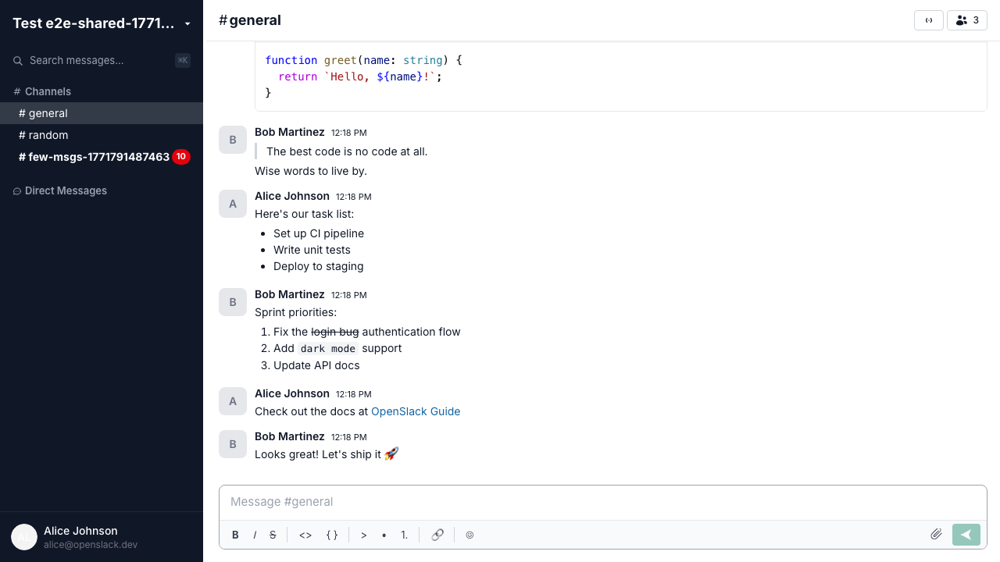
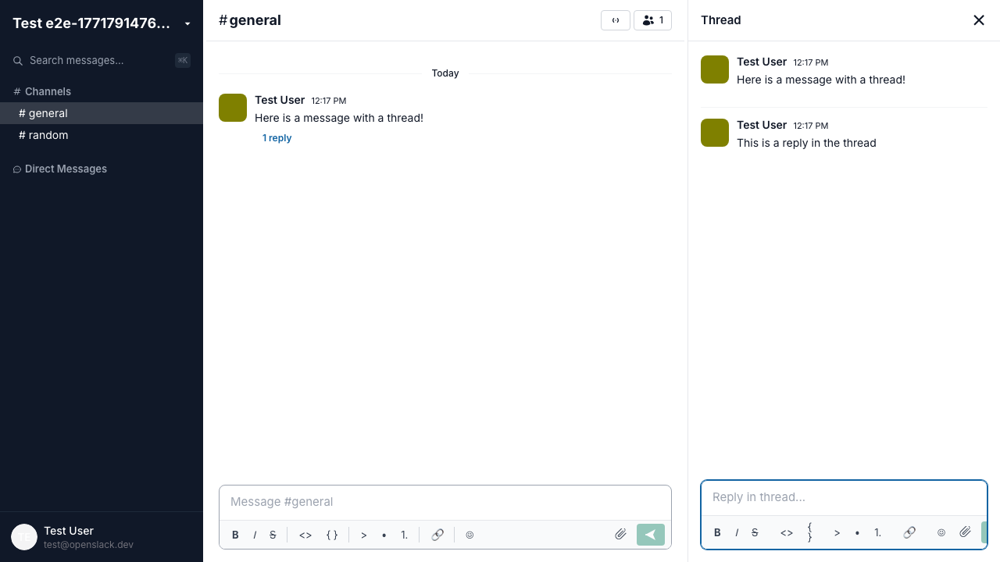
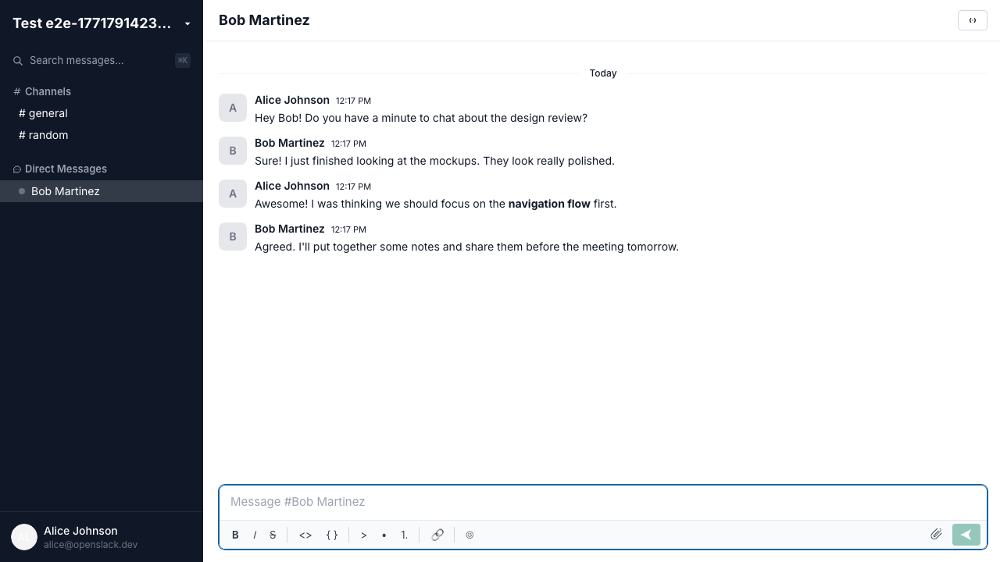
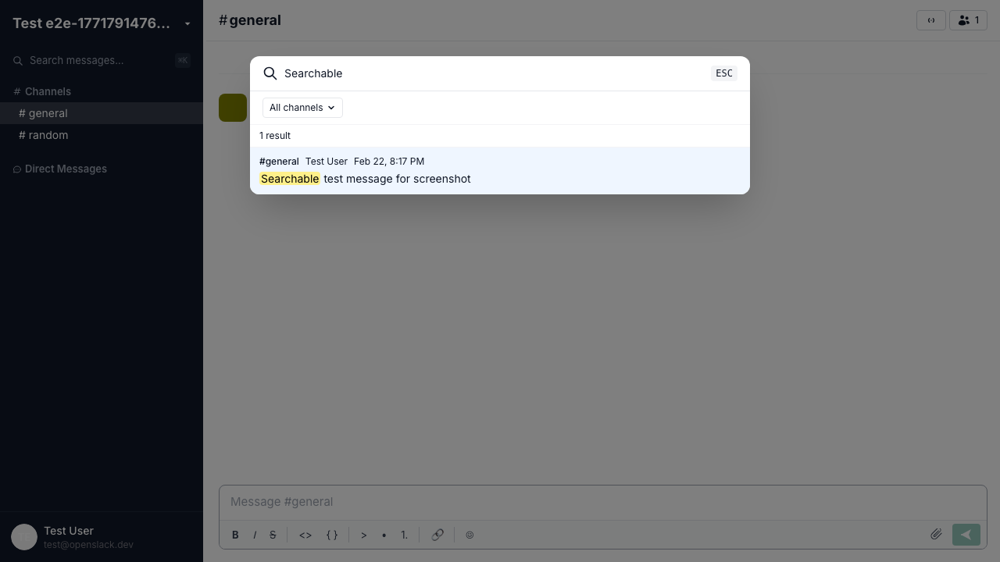

# OpenSlack

**Open-source Slack**

[](LICENSE)
[](https://bun.sh)
[](https://www.typescriptlang.org/)
[](https://github.com/BilalG1/openslack/pulls)

<p align="center">
  
</p>

Real-time team messaging with channels, threads, DMs, huddles, search, and file sharing. Self-host in minutes with Docker.

## Quick Start

Prerequisites: [Bun](https://bun.sh) (v1.1+), [Docker](https://www.docker.com/)

```bash
git clone https://github.com/BilalG1/openslack.git
cd openslack
bun install
cp .env.example .env
docker compose up -d
bun run --filter @openslack/api db:migrate
bun run dev
```

Open [http://localhost:3000](http://localhost:3000).

## Feature Comparison

| Feature | Slack | OpenSlack |
| --- | :---: | :---: |
| **Messaging** | | |
| Channels (public & private) | :white_check_mark: | :white_check_mark: |
| Direct messages | :white_check_mark: | :white_check_mark: |
| Threaded replies | :white_check_mark: | :white_check_mark: |
| Rich text editor | :white_check_mark: | :white_check_mark: |
| Emoji reactions | :white_check_mark: | :white_check_mark: |
| Message edit & delete | :white_check_mark: | :white_check_mark: |
| File uploads & previews | :white_check_mark: | :white_check_mark: |
| Message search | :white_check_mark: | :white_check_mark: |
| @mentions | :white_check_mark: | — |
| **Real-time** | | |
| Typing indicators | :white_check_mark: | :white_check_mark: |
| Presence (online/offline) | :white_check_mark: | :white_check_mark: |
| Unread counts | :white_check_mark: | :white_check_mark: |
| Desktop notifications | :white_check_mark: | :white_check_mark: |
| **Huddles** | | |
| Voice huddles | :white_check_mark: | :white_check_mark: |
| Video huddles | :white_check_mark: | — |
| Screen sharing | :white_check_mark: | — |
| **Organization** | | |
| Workspaces | :white_check_mark: | :white_check_mark: |
| Invite links | :white_check_mark: | :white_check_mark: |
| Member roles | :white_check_mark: | :white_check_mark: |
| **UI** | | |
| Dark mode | :white_check_mark: | :white_check_mark: |
| Syntax-highlighted code blocks | :white_check_mark: | :white_check_mark: |
| **Platform** | | |
| Self-hosted | — | :white_check_mark: |
| Open source | — | :white_check_mark: |
| Bots & integrations | :white_check_mark: | — |
| Workflow builder | :white_check_mark: | — |
| Enterprise SSO/SAML | :white_check_mark: | — |

## Screenshots

<table>
  <tr>
    <td align="center"><strong>Threads</strong></td>
    <td align="center"><strong>Direct Messages</strong></td>
  </tr>
  <tr>
    <td></td>
    <td></td>
  </tr>
  <tr>
    <td align="center" colspan="2"><strong>Search</strong></td>
  </tr>
  <tr>
    <td colspan="2"></td>
  </tr>
</table>

## License

[MIT](LICENSE)
